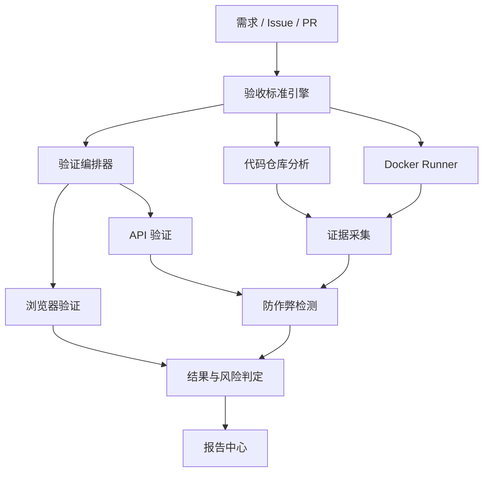

# AgentProof 项目阶段开发计划

> 由 `docs/source/AgentProof_项目阶段开发计划_优化版.docx` 转换，并按 2026-07-11 的最新决定修正 M0/M4 边界。本文描述规划，不代表能力已经实现。

## 1. 项目定位

AgentProof 是独立于 Codex、Claude Code、Cursor 等编程 Agent 的第三方验收层。它不采信“任务已完成”的自述，而是针对固定代码版本，在独立环境中真实安装、构建、启动并操作项目，把自然语言需求拆成可确认的验收项，再用 API、浏览器、数据库、退出码和 Git Diff 等证据证明需求是否完成。

项目使命：连接需求、代码、运行环境、测试和证据，输出逐项、可解释、可复现的验收结论与风险，而不是给出一个无法追溯的模糊总分。

### 1.1 要解决的问题

- 编程 Agent 可能在漏实现、测试失败或边界遗漏时宣布完成。
- Agent 可能同时修改既有测试，使“测试通过”失去独立性。
- 非专业用户难以通过代码审查判断功能是否真的完成。
- 普通 CI 主要执行既有构建和测试，不能自动覆盖自然语言需求中的行为验收。
- 偶然成功不代表稳定，验收必须记录版本、环境、数据和证据并允许重放。

### 1.2 核心价值

| 价值 | 做法 | 结果 |
| --- | --- | --- |
| 独立 | 规则、隐藏用例、证据目录与被验收代码隔离 | 降低修改规则或伪造证据的机会 |
| 真实 | 在受限临时环境中实际运行项目 | 结论来自行为而非模型猜测 |
| 可解释 | 每个验收项关联原始证据 | 用户知道为何通过或失败 |
| 可复现 | 固定代码、规则、环境、命令、数据和随机种子 | 同一版本可重放和比较 |
| 可扩展 | 验证器使用统一接口 | 在证据和需求成立后扩展生态 |

### 1.3 不做什么

- 不做新的 IDE，也不替代编程 Agent。
- 本地 MVP 不自动修复代码。
- 本地 MVP 不支持所有语言、框架或桌面应用。
- 不把大模型判断当作最终证据。
- 不在宿主机直接执行不可信项目代码。

## 2. 用户与典型场景

以下是产品假设中的目标用户，不代表已完成采访、市场验证或付费验证：Vibe Coding 用户、Codex/Claude Code 用户、独立开发者、程序员接单者、小型开发团队和开源维护者。

首个场景：用户输入一个 Web 功能需求，并导入本地 Git 仓库或已经检出的 PR 分支。AgentProof 在隔离环境中启动项目，验证页面、接口和数据变化，最后生成逐项证据报告。

示例需求：增加用户注册，要求邮箱唯一、密码不明文保存、注册后自动登录、失败时有清晰提示。可能的验收项包括合法注册、重复邮箱错误、密码哈希、有效登录状态、错误提示，以及大小写/空格归一化后的唯一性。

## 3. MVP 边界与产品原则

### 3.1 本地 MVP 优先支持

- Web 应用，Node.js / TypeScript 优先。
- 本地 Git 仓库或已检出的 PR 分支。
- Docker Desktop 与 Linux 临时容器。
- 构建、现有测试、API-first 验证。
- 一条关键 Playwright 用户流程。
- 基础数据库检查、Git Diff。
- HTML / Markdown 证据报告。

详细兼容边界见 [support-matrix.md](support-matrix.md)。

### 3.2 本地 MVP 不包含

GitHub App、Mutation Testing、Python 等多语言生态、云端 Runner、自动修复、企业多租户、多 Agent 对比和通用桌面应用测试。

### 3.3 产品原则

1. **确定性优先**：能由状态码、JSON、DOM、数据库、退出码、哈希和 Diff 判断的，不交给模型主观判断。
2. **证据优先**：每个重要结论能追溯到真实运行证据。
3. **用户确认**：模型建议的验收项必须可编辑、确认和版本化。
4. **最小权限**：不可信代码只在受限临时容器中运行。
5. **渐进兼容**：先支持规范项目；识别失败时允许显式配置。
6. **失败可见**：无法验证、规格不足、环境错误和不稳定均需明确显示。
7. **门禁推进**：未通过当前里程碑退出门禁，不进入下一里程碑。

## 4. 系统架构

### 4.1 信任与执行边界

可信控制面管理验收规则、任务编排、容器生命周期、证据 Manifest 和密钥；不可信执行面安装并运行目标仓库。被验收容器不得获得 Docker Socket、宿主机个人目录、SSH Key、真实 `.env`、私人凭据或不受限制的网络和资源。详细要求见 [threat-model.md](threat-model.md)。Docker 只能降低风险，不能提供绝对安全。

### 4.2 核心模块

| 模块 | 职责 |
| --- | --- |
| 项目管理 | 仓库、分支、Commit、启动配置和历史运行记录 |
| 需求与验收标准 | 原始需求、结构化验收项、人工编辑和版本化 |
| 仓库分析器 | 技术栈、脚本、端口、数据库、环境变量、测试框架和 Diff |
| 验证编排器 | 验证器选择、依赖、超时、重试和结果聚合 |
| Docker Runner | 由可信控制面创建/销毁受限临时执行环境 |
| 验证器插件 | 构建、现有测试、API、浏览器、数据库、Diff、基础安全和控制台错误 |
| 证据中心 | 截图、响应、日志、查询、堆栈、Manifest、脱敏与清理 |
| 防作弊引擎 | 测试/配置变化、隐藏用例、随机数据和硬编码风险 |
| 报告中心 | 按验收项组织状态、证据、风险和合并建议 |
| GitHub 集成 | M4 才读取 Issue/PR/Diff 并发布 PR Check |

验证器应实现统一的 `supports()` 与 `verify()` 契约；具体接口在 M2 前固化。计划中的验证器包括 Build、ExistingTest、API、Browser、Database、Diff、Security 和 ConsoleError。

## 5. 数据模型与结果语义

| 实体 | 关键内容 |
| --- | --- |
| Project | 仓库、本地路径、默认分支、技术栈、安装/构建/启动/测试命令 |
| Requirement | 原始需求、来源、Issue、创建者和版本 |
| AcceptanceCriterion | 编号、描述、前置条件、步骤、输入、预期、验证方式和严重级别 |
| VerificationRun | 代码版本、规则版本、状态、环境、时间和总体建议 |
| VerificationResult | 验收项、验证器、底层状态、失败原因、确定性证据和模型摘要 |
| EvidenceArtifact | 类型、路径、哈希、生成步骤和证据内容 |
| Finding | 风险类型、严重度、影响范围、Diff、证据和修复建议 |
| RunnerProfile | 镜像、Node 版本、资源限制、网络策略、命令和端口 |

底层结果只使用：`passed`、`failed`、`insufficient_spec`、`infrastructure_error`、`unverifiable`、`unstable`。最终合并建议只使用：`recommend_merge`、`do_not_merge`、`human_review`、`indeterminate`。聚合规则见 [glossary.md](glossary.md)。

## 6. 规划技术栈

以下是后续实现建议，不是当前依赖或支持承诺。

| 层级 | 规划 | 最早阶段与理由 |
| --- | --- | --- |
| CLI/控制面 | Node.js + TypeScript | M1；与首批项目生态一致 |
| 后端 API | Fastify + TypeScript + Zod | M2；Zod 为领域 Schema 单一事实来源 |
| 本地数据库 | SQLite；ORM 实现前再确认 | M2；单机低并发优先 |
| 浏览器验证 | Playwright | M3；关键流程、截图和 Trace |
| 完整前端 | Next.js + Tailwind CSS + shadcn/ui | M3 闭环稳定后，不先于 CLI/API 价值 |
| Git | 系统 Git CLI | Diff、Worktree、Commit 管理成熟可复现 |
| 实时状态 | Server-Sent Events | 后续界面需要时使用单向状态推送 |
| 模型层 | 统一 Model Adapter | 仅结构化建议与摘要，记录模型/提示/Schema 版本 |
| 工程结构 | pnpm Monorepo | 业务开发启动后评估并创建；本次不搭建 |
| 执行沙箱 | 临时 Linux 容器 + 最小权限 | M1 起固定资源、网络、时长和目录访问 |
| 证据完整性 | 可信 Manifest + 文件哈希 | 绑定 Commit、规则、镜像、命令、种子和证据 |

未来实现结构可包含 `apps/`、`packages/` 和 `docker/`，但这些目录只有在相应里程碑获准进入时才创建。

## 7. M0-M4 总览

| 里程碑 | 核心目标 | 单人范围估算 | 退出摘要 |
| --- | --- | --- | --- |
| M0：问题与技术可行性验证 | 建立失败基准、官方 Demo 设计与检测可行性 | 5-10 人日 | ≥20 个有来源案例；Demo ≥5 类缺陷；威胁/支持/Schema 完成 |
| M1：安全执行内核与 CLI POC | 隔离、稳定、可复现地运行规范 Node.js 项目 | 15-25 人日 | 3 个样例；连续 10 次一致；隔离烟测通过 |
| M2：API-first 垂直验收闭环 | 需求→验收项→API 断言→证据→结论 | 15-25 人日 | ≥5 类需求；每项结论关联原始证据 |
| M3：浏览器验证与防作弊轻量版，本地 MVP | 关键页面流程、数据一致性、测试 Diff 与只读验收目录 | 20-35 人日 | 官方缺陷分支无漏判；同 Commit 3 次一致 |
| M4：Alpha 发布与 GitHub 工作流 | 真实用户、外部项目、GitHub App 与 PR Check | 15-25 人日 | ≥10 名真实用户；≥5 个非官方项目；PR 绑定 Head Commit |

各阶段的完整输入、任务、交付、非目标、安全要求和量化门禁见 [milestones/](milestones/)。M0 不要求用户采访或付费验证；真实用户和外部项目 Alpha 验证在 M4。

## 8. 官方 Demo

官方 Demo 是长期回归基准，不是宣传页面。建议使用小型后台管理系统，包含注册、登录、角色权限、文章或订单管理和 SQLite。M0 只定义和建立基准；后续每个版本必须回归正确版本与缺陷版本。

| 缺陷 | 故意问题 | 预期证据 |
| --- | --- | --- |
| 表面完成 | UI 提示成功但后端未保存 | 页面截图、API 响应、数据库无记录 |
| 权限漏洞 | 前端隐藏入口但普通用户可直达 URL | 普通角色浏览器上下文成功访问 |
| 测试削弱 | 401 改成 200 或删除失败测试 | 测试 Diff、断言风险、隐藏用例失败 |
| 硬编码 | 只有固定演示账号可用 | 随机账号失败、固定账号成功、重复差异 |
| 状态不持久 | 页面更新但刷新后消失 | 刷新前后截图、网络响应、数据库查询 |
| API 失败但 UI 成功 | 接口错误而页面仍提示成功 | 网络/控制台错误与页面文本不一致 |
| 构建通过但运行时失败 | 构建成功，启动或首个请求失败 | 构建退出码、启动日志、健康检查失败 |

## 9. 质量与发布门禁

- 功能门禁：阶段验收项全部满足。
- 回归门禁：官方 Demo 的正确版本和历史缺陷版本无退化。
- 安全门禁：不可信代码无法读取宿主敏感资源或 Docker Socket；网络与资源限制通过烟测。
- 可用性门禁：从 M4 起陌生用户可按文档完成安装、导入和一次验证。
- 文档门禁：新增能力、限制、配置和排错均已更新。
- 证据门禁：重要结论可追溯到可信 Manifest，敏感字段已脱敏，保留与清理策略明确。

Runner、编排器、验证器和结果聚合在实现后必须有单元测试；官方缺陷分支进入端到端回归；重复运行记录种子与环境；`unverifiable` 必须说明原因；报告失败不得覆盖原始证据。

## 10. 主要风险

| 风险 | 应对 |
| --- | --- |
| 范围失控 | 只承诺支持矩阵内的规范 Node.js Web 项目 |
| 模型误判 | 用户确认验收项；最终结论依赖确定性断言和证据 |
| 自动化不稳定 | 稳定定位器、明确等待、Trace、重复执行和种子 |
| 不可信代码 | 控制/执行分离、无 Docker Socket、最小权限、网络/资源限制、临时环境 |
| 误判测试修改为作弊 | 只给风险提示，展示具体 Diff 和影响，不直接定罪 |
| 项目兼容性差 | 显式配置优先、自动识别辅助、保守支持矩阵和诊断 |
| 证据成本 | 默认关键证据、完整 Trace 可配置、保留/清理策略 |
| 证据泄密或伪造 | 可信 Manifest、脱敏、鉴权、保留期限、可信根与密钥策略 |
| 依赖/镜像漂移 | 固定 lockfile 与镜像摘要，记录环境、种子和缓存策略 |

## 11. 开源路线

计划开源核心 Runner、验证器接口、基础报告和本地运行能力；公开威胁模型与支持边界；使用兼容性、误判、漏判、验证器建议和安全问题的 Issue 分类；建立贡献指南。只有产品真实可用后才提供安装命令、功能截图或对比结果，不得提前制造虚假展示。

商业化只在真实用户愿意反复运行验收后讨论。可能的后续能力包括云端 Runner、GitHub 自动验收、团队历史、私有规则、并发任务、长时运行、视频证据、多 Agent 对比和私有部署；当前没有付费或意愿数据。

## 12. 后续版本路线

| 版本 | 能力 |
| --- | --- |
| V1：本地验收 | Node.js Web、本地 Git、安全 CLI Runner、API-first、一条关键浏览器流程、基础防作弊和证据报告 |
| V2：GitHub PR | GitHub App、Issue 绑定、PR 自动运行、Check、权限和历史对比 |
| V3：更多生态 | 在真实需求证明后扩展 Python/FastAPI、常见数据库、Docker Compose、OpenAPI |
| V4：团队版本 | 团队项目、规则模板、权限、审计、共享报告、私有 Runner |
| V5：多 Agent 对比 | 对比完成率、稳定性、成本和缺陷 |
| V6：云端服务 | 托管 Runner、并发队列、计费和企业私有部署 |

## 13. 后续执行顺序

1. 完成 M0 的失败案例收集、去重、脱敏、复现和人工审核。
2. 建立官方 Demo 的正确版本与至少 5 类稳定缺陷版本，并记录每类预期检测方式与证据。
3. 用最小只读/手工实验验证检测思路，完成 M0 退出评审。
4. M0 通过后，才进入 M1 安全 CLI Runner。
5. M1 通过后做 M2 API-first；M2 通过后做 M3 本地 MVP；M3 通过后做 M4 Alpha 与 GitHub。
