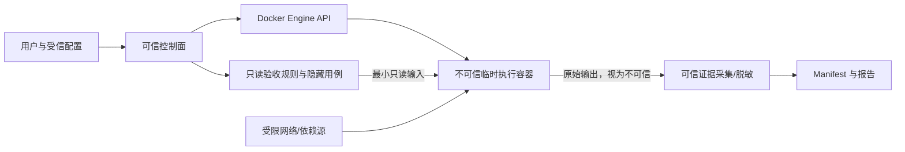

# VeriCrate 初版威胁模型

## 1. 目的与安全声明

VeriCrate 需要运行不可信仓库及其依赖，攻击面高于普通只读代码分析。目标是降低宿主机、凭据、控制面和证据被攻击的概率与影响，并让剩余风险可见。Docker 不是绝对安全边界；容器逃逸、内核漏洞、Docker Desktop/虚拟化缺陷和供应链攻击无法仅靠容器配置完全消除。

本文件是 M0 的设计基线。M1 必须用可复现烟测证明关键隔离，而不是只检查配置文本。

## 2. 系统资产

- 宿主机个人目录、文件、剪贴板和本地应用数据。
- SSH Key、Git 凭据、npm Token、云凭据、Cookie、会话和真实 `.env`。
- Docker Engine、Docker Desktop VM、宿主内核与网络。
- VeriCrate 控制面、验收规则、隐藏用例、配置和签名密钥。
- 被验收仓库、Commit、Diff、构建产物和测试数据。
- 原始证据、日志、截图、响应、数据库快照、Trace 和报告。
- 证据 Manifest、哈希、时间信息、随机种子和规则版本。
- 用户/第三方个人数据与商业敏感信息。

## 3. 信任边界

### 3.1 控制面

控制面负责策略、任务编排、镜像选择、临时目录、资源与网络限制、密钥注入、容器销毁、证据采集、脱敏、Manifest 生成和报告聚合。控制面是可信计算基的一部分，必须小、可审计，并拒绝执行面修改策略。

### 3.2 执行面

执行面包含目标仓库、包管理器、依赖安装脚本、构建/测试/启动进程和被测服务。全部视为不可信。执行面输出的日志、截图、JUnit、JSON 和文件也必须视为攻击者可控输入，经过路径、大小、格式和脱敏校验后才能进入证据系统。

### 3.3 绝不允许跨越的边界

被验收容器不得获得 Docker Socket、宿主机个人目录、SSH Key、真实 `.env`、用户私人凭据、控制面签名密钥、可写验收规则或不受限制的网络和计算资源。

## 4. 攻击者能力假设

攻击者可以完全控制仓库内容、Git 历史、文件名、符号链接、package scripts、依赖声明、测试、构建输出、HTTP 响应、页面 DOM、日志内容和退出时机；可以尝试探测环境、消耗资源、访问网络、伪造证据文件、利用已知/未知漏洞，或通过输出注入误导报告解析。

不假设攻击者拥有宿主机管理员权限；若宿主机、Docker Desktop 或控制面已被攻破，本地 MVP 无法保证安全或证据可信。

## 5. 威胁与控制

| 威胁 | 典型路径 | 最低控制 | 剩余风险/结果 |
| --- | --- | --- | --- |
| 恶意仓库 | 构建、测试、启动脚本执行任意代码 | 只在临时执行面运行；非 root；最小 capabilities；只读根文件系统（必要写目录单列）；超时与销毁 | 容器逃逸或引擎漏洞仍可能影响宿主 |
| 恶意依赖安装脚本 | `preinstall`/`postinstall` 下载或窃取数据 | 生命周期脚本策略显式记录；默认网络受限；无宿主凭据；固定 lockfile/registry；必要时先禁脚本诊断 | 禁脚本可能导致合法项目无法构建，应返回 `infrastructure_error` 或 `unverifiable`，不能悄悄放宽 |
| Docker Socket | 挂载 `/var/run/docker.sock` 后控制主机容器 | 绝不挂载；Docker API 只由控制面访问；烟测验证路径和协议不可达 | 控制面本身仍需保护 Docker 权限 |
| 凭据泄露 | 环境变量、Git 配置、npmrc、云元数据 | 不复制真实 `.env`/配置；任务专用短期最小权限凭据；环境白名单；报告脱敏；运行后撤销 | 目标代码仍可能窃取任务专用凭据，需缩小权限和寿命 |
| 宿主目录泄露 | bind mount、符号链接、路径穿越 | 仅挂载新建临时工作区和必要只读输入；解析真实路径；拒绝越界符号链接；不挂个人目录 | Docker/文件系统实现漏洞仍存在 |
| 网络外传 | 将代码、证据或 Token 发往外部 | 默认拒绝出站；按主机/端口/阶段白名单；依赖代理；DNS 与连接审计；禁止访问本机与云元数据地址 | 域名劫持、允许源被攻破和隐蔽通道不能完全消除 |
| 资源耗尽 | fork bomb、磁盘填满、日志洪泛、压缩炸弹 | CPU、内存、PID、磁盘、文件数、日志大小、运行时长限制；取消与清理 | Docker Desktop/宿主资源竞争仍可能影响其他任务 |
| 容器逃逸 | 内核、运行时或 Docker Desktop 漏洞 | 固定并更新可信基础镜像；非 root；drop capabilities；no-new-privileges；seccomp；不使用 privileged/host namespace/device | 无法宣称完全解决；高风险仓库需要更强 VM/远程隔离 |
| 证据篡改 | 仓库写入伪造截图/日志/Manifest | 证据目录不由目标代码直接写；控制面采集；文件哈希；原始流与派生报告分层；Manifest 绑定上下文 | 若控制面或签名密钥失陷，证据可信根失效 |
| 输出/路径注入 | ANSI、HTML、Markdown、超长字段、`../` 文件名 | 输出作为数据转义；路径规范化；允许的证据类型与大小；禁止报告执行脚本；内容安全策略 | 查看器漏洞和复杂格式解析风险仍存在 |
| 日志/截图/Token/Cookie/个人数据泄露 | 请求头、页面、Trace、数据库查询进入报告 | 采集前最小化；结构化字段级脱敏；截图遮挡策略；报告访问控制；保留期限与清理；禁止公开默认链接 | 自动脱敏可能漏报；发布前需人工复核高敏任务 |
| 依赖与镜像漂移 | 同 Commit 因 registry、镜像、缓存变化结果不同 | lockfile；固定镜像 digest；记录 registry、Node/OS、缓存策略和随机种子；支持重放 | 上游包撤回、平台时间和外部服务仍会造成变化 |
| 验收规则被修改 | 目标仓库覆盖隐藏用例、断言或顺序 | 规则由控制面提供并只读；规则版本和哈希进入 Manifest；输入/顺序随机化 | 运行时可观察规则可能被针对，需最小暴露 |
| 服务攻击控制面 | 被测服务响应利用解析器/浏览器 | 解析限额、超时、隔离浏览器上下文、禁下载/弹窗/外部导航、补丁管理 | 浏览器/解析器零日风险仍存在 |

## 6. Manifest 可信根

Manifest 至少记录：目标 Commit、验收规则版本与哈希、RunnerProfile、基础镜像 digest、Node/包管理器/OS 版本、完整命令与退出码、开始/结束时间、随机种子、网络和资源策略、每个证据文件的类型/大小/哈希、脱敏版本和聚合器版本。

Manifest 必须由可信控制面在执行面之外生成。仅有文件哈希不能证明“证据来自这次可信运行”；后续应评估签名密钥保护、时间来源、运行身份、密钥轮换和校验工具。签名密钥不得进入目标容器。

## 7. 证据隐私与保留

- 默认只采集证明结论所需的最小证据，不默认保存完整视频或全库快照。
- 请求头、Cookie、Token、Authorization、密码、个人身份信息和业务数据使用结构化脱敏；禁止只依赖宽泛正则。
- 原始证据与脱敏派生物分层；访问原始证据需要更高权限和审计。
- 报告 HTML 不执行仓库提供的脚本或未经净化的标记。
- 明确保留期限、删除失败处理和备份策略；M4 前完成用户可见隐私说明。

## 8. 依赖与镜像治理

- 只允许支持矩阵内的 lockfile；缺失 lockfile 明确拒绝支持。
- 基础镜像使用 digest 固定，更新需要回归官方 Demo 和隔离烟测。
- 记录依赖源、代理、缓存命中与生命周期脚本策略。
- 缓存不得在不可信项目间泄露凭据或可写状态；首版可优先禁用跨项目可写缓存。
- 漂移导致结论不一致时使用 `unstable`；环境自身失败使用 `infrastructure_error`。

## 9. 已知无法完全解决的风险

- 容器、内核、Docker Desktop、浏览器和解析库的未知漏洞。
- 已被攻破的宿主机、控制面或签名密钥。
- 合法白名单网络端点被攻击或用于外传。
- 自动脱敏漏掉图片、二进制和领域特定敏感信息。
- 测试通过只能证明已声明验收项，不证明所有业务正确性。
- 外部服务、时钟、随机性和不可固定依赖导致的非确定性。

高风险或强对抗仓库可能需要一次性 VM、远程隔离主机、硬件/云身份或更强沙箱；这些不属于本地 MVP 承诺。

## 10. M1 必须通过的隔离烟测

所有烟测必须在与正式 Runner 相同的创建路径执行，保存命令、退出码、日志和环境。任何阻断项失败都禁止进入 M2。

| 编号 | 烟测 | 通过条件 |
| --- | --- | --- |
| ISO-01 | 读取宿主机用户目录和典型路径 | 路径未挂载且不可读；临时工作区外访问失败 |
| ISO-02 | 查找/读取 SSH Key、Git 凭据、npmrc、真实 `.env` | 目标容器内不存在；环境和挂载清单无泄露 |
| ISO-03 | 访问 Docker Socket 和常见 Docker API 地址 | Socket 不存在；API 不可达；容器无法创建/控制其他容器 |
| ISO-04 | 检查可写挂载、规则目录和证据目录 | 仅允许的临时目录可写；验收规则只读；Manifest/最终证据目录不可由目标代码写 |
| ISO-05 | 出站访问公共站点、宿主网关、localhost、云元数据地址 | 默认全部拒绝；白名单模式只允许精确目标 |
| ISO-06 | CPU/内存/PID 压力与 fork bomb | 资源受限，任务被终止，宿主和控制面保持可用 |
| ISO-07 | 磁盘、文件数、日志洪泛和超大证据 | 达到配额后受控失败并清理，不填满宿主磁盘 |
| ISO-08 | 超时、取消和僵尸进程 | 到时/取消后进程与容器被终止，临时资源可核对清理 |
| ISO-09 | 非 root、capabilities、no-new-privileges、namespace | 不以特权模式运行；无额外设备/host namespace；提权尝试失败 |
| ISO-10 | 符号链接与路径穿越 | 不能借链接或 `../` 读写临时工作区外路径 |
| ISO-11 | 伪造证据/Manifest | 目标代码生成的同名文件不被当作可信 Manifest；哈希和生成者边界可验证 |
| ISO-12 | Token/Cookie/个人数据脱敏 | 预置金丝雀敏感值不出现在默认报告、日志展示或公开导出 |
| ISO-13 | 固定镜像与重放 | Manifest 记录 digest、环境和策略；同 Commit/种子可重放 |
| ISO-14 | 清理失败注入 | 清理异常可见、可重试并告警，不静默留下含敏感数据的资源 |

## 11. 复审触发条件

支持新语言、Docker Compose、私有包、外部服务、云端 Runner、GitHub App、共享缓存、视频/Trace、多人访问或企业部署前，必须更新本威胁模型并增加对应烟测。安全问题不得以完成度分数抵消。

## 12. M0-07 安全评审结论

M1 Runner 输入规范见 [m1-runner-input-spec.md](m1-runner-input-spec.md)。该规范符合本威胁模型的核心边界：控制面负责策略、镜像、临时目录、资源、网络、挂载、证据采集和清理；目标仓库、依赖安装脚本、测试、HTTP 服务和全部输出均视为不可信。

M1 不得挂载 Docker Socket、宿主个人目录、SSH Key、真实 `.env`、浏览器 Cookie、Git/npm/cloud 凭据或控制面密钥；不得允许 privileged、host network、宿主设备、无限制网络或无限制资源。验收规则与最终 Manifest 必须位于目标代码不能写入的位置，目标输出只能作为不可信原始材料进入脱敏和哈希流程。

ISO-01 至 ISO-14 隔离烟测必须通过真实 Runner 创建路径执行，并保存命令、退出码、日志、环境摘要和清理结果。若 M1 无法证明资源限制、网络策略、路径边界、证据边界或敏感信息脱敏有效，不能进入 M2。

## 13. M1-07 隔离烟测结论

`npm run m1:isolation` 已在 Docker Desktop 29.6.1 上通过 ISO-01 至 ISO-14，并保存 `artifacts/m1-isolation-smoke/summary.json` 与 `artifacts/m1-isolation-smoke/report.md`。烟测使用真实 Runner 策略或同等 Docker 参数验证宿主路径、凭据、Docker Socket、网络、资源、只读挂载、timeout 清理、权限、路径穿越、可信 Manifest 边界、敏感金丝雀、固定镜像重放和清理失败注入。

该结论只覆盖 M1 本地 MVP 的默认策略；Docker 仍不是绝对安全边界。后续若支持私有包、外部服务、共享缓存、浏览器 Trace、GitHub App 或云端 Runner，必须重新复审本威胁模型并增加对应烟测。
